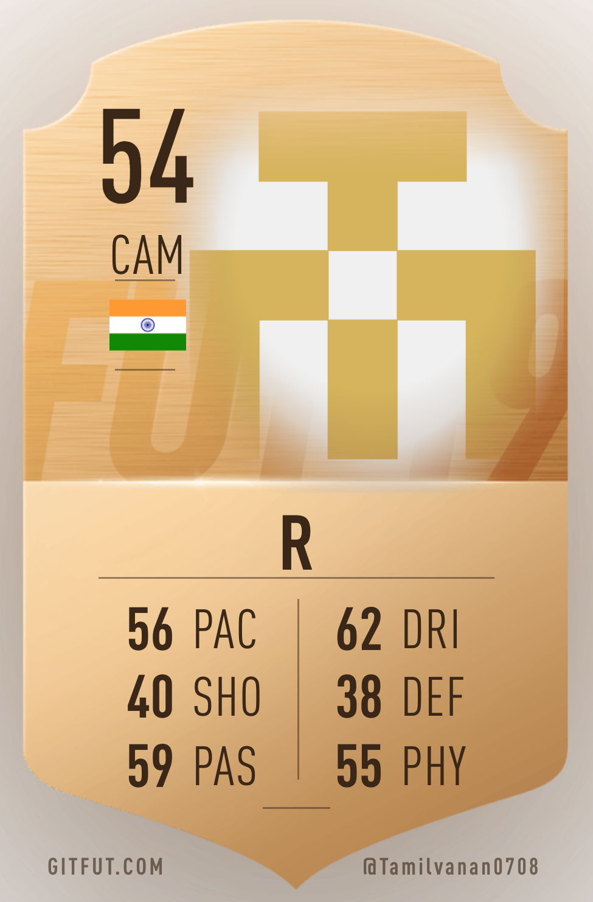

# 👋 Hi, I'm Tamilvanan R

### AI Engineer | Full Stack Developer | Generative AI Engineer

Building AI-powered conversational platforms, intelligent web applications, and cross-platform mobile applications.

 

---

# 💫 About Me

🚀 AI Engineer at **Swivel Technology**

🤖 Working on **Swico.in**, an AI-powered conversational platform

💡 Passionate about

- Generative AI
- Large Language Models (LLMs)
- AI Agents
- Prompt Engineering
- Retrieval-Augmented Generation (RAG)
- Full Stack Development

🌱 Currently Learning

- Multi-Agent AI Systems
- AI Automation
- Advanced RAG Architecture
- Scalable AI Applications

💬 Ask me about

- Python
- FastAPI
- React.js
- Flutter
- OpenAI API
- FAISS
- PostgreSQL
- Prompt Engineering

---

# 🌐 Connect With Me

---

# 💻 Tech Stack

## 👨‍💻 Programming Languages

---

## 🎨 Frontend

---

## ⚙ Backend

---

## 📱 Mobile

---

## 🗄 Database

---

## 🤖 Artificial Intelligence

- OpenAI API
- LangChain
- Retrieval-Augmented Generation (RAG)
- FAISS
- Prompt Engineering
- AI Agents
- Conversational AI
- LLM Integration

---

## ☁ Cloud & DevOps

---

# 🚀 Professional Experience

## AI Engineer

**Swivel Technology**

📍 Chennai, India

### Current Project

### 🤖 Swico.in

Contributing to the development of an AI-powered conversational platform by working on

- AI Model Integration
- OpenAI API
- FastAPI Backend
- PostgreSQL
- React Integration
- FAISS Vector Search
- Retrieval-Augmented Generation (RAG)
- Prompt Engineering
- Render Deployment
- Performance Optimization
- Bug Fixes & Feature Development

---

# 🚀 Featured Projects

## 🤖 Swico.in

**Professional Team Project**

**Tech Stack**

Python • FastAPI • React • PostgreSQL • OpenAI API • FAISS • Render

---

## 🏏 ScoreX Cricket Management System

Flutter application for cricket scoring, tournament management, player statistics, and team administration.

**Tech**

Flutter • Supabase • PostgreSQL

---

## 🐔 Chicken Shop Management System

Business management application with inventory, billing, customer management, and voice-assisted order entry.

**Tech**

Flutter • Supabase • PostgreSQL

---

## 🛒 E-Commerce Website

Complete online shopping platform with authentication, payments, shopping cart, and admin dashboard.

**Tech**

React • Supabase • PostgreSQL • Razorpay

---

## 💧 Water Delivery Management Website

Online ordering and subscription platform for water delivery services.

**Tech**

React • Supabase • PostgreSQL

---

## 🐓 Chicken Shop Online Sales Website

Modern online ordering system for retail chicken businesses.

**Tech**

React • Supabase • PostgreSQL

---

# 📈 GitHub Statistics

---

# 🔥 GitHub Streak

---

# 📊 Contribution Graph

---

# 🏆 GitHub Trophies

---

# 💡 Currently Exploring

- 🤖 AI Agents
- 🧠 Multi-Agent Systems
- 📚 Advanced RAG
- ⚡ FastAPI Performance Optimization
- ☁ Cloud Deployment
- 📱 Flutter Applications

---

# 📫 Contact

📧 **tamilvananrm78@gmail.com**

📍 **Chennai, Tamil Nadu, India**

---

### ⭐ Thanks for visiting my profile!

*"Building intelligent software that solves real-world problems through Artificial Intelligence."*

